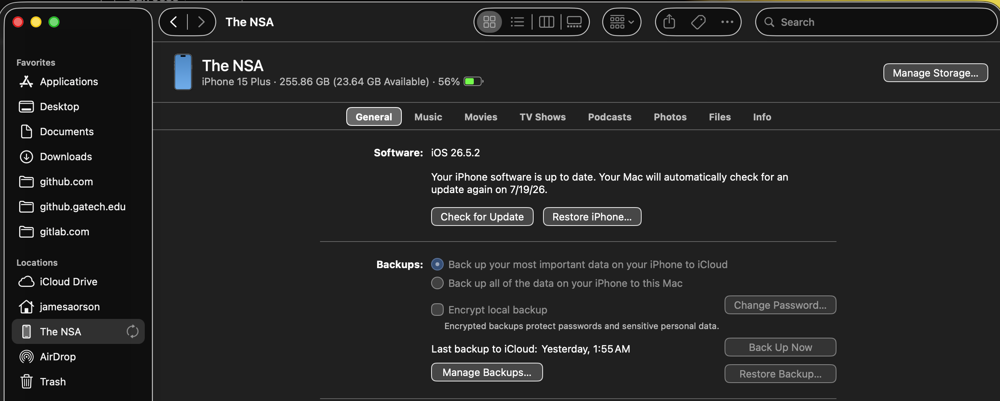
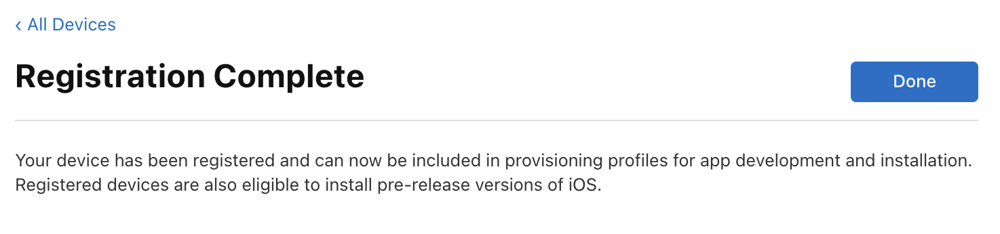

# iOS Mobile Dev Setup

Total nightmare.

## Setup

Install XCode, including the iOS dev kit.

## Opening Autobutler

Open the [Runner XCode project](../ios/Runner.xcodeproj/)

## Setting up Development Profile

Once project is open, go to the Runner project's "Signing and Capabilities" menu by Clicking on the top-level Runner item
in the file tree thing.

Login with an account tied to Autobutler LLC, then you should get that as an option in the "Team" dropdown on the side.

## Signing Certificate

Under "Signing Certificate", you should have some big warning message. Just go to the link there and follow the instructions
to add your iOS device to your developer account as a trusted device.

### Offline

When it asks you, say "Yes" to having offline support. This lets you use the dev install of the app for 7 days at a time
with no internet connection to refresh it.

### UDID

At some point, the website will ask you for your phone's UDID, which you can find by plugging in your phone via USB, trusting
the device, then going to it in Finder.

Where it shows the kind of iPhone and storage under the phone name in this menu, just click that text and it will change
to a serial and other numbers. Click it until the UDID shows up.

You CANNOT copy and paste this value. You must type it out by hand elsewhere, and then put it in the web site. `¯\_(ツ)_/¯`

After copying that in and clicking register a few times, you will get a registration complete page.

## Ready to Dev

Go back to XCode now, change tabs back and forth and now the page should look like so.

## Running On the Device

My phone is called "The NSA", so at the top of XCode make sure your phone is now selected like mine is, as that makes it
the "Run Target" for the app.

Then click "Project -> Run" to compile and hand off to device.

