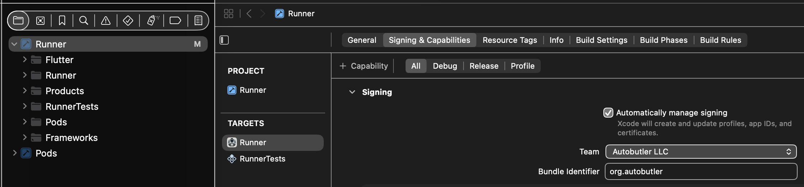
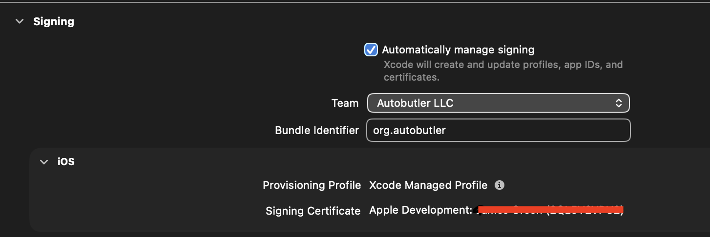
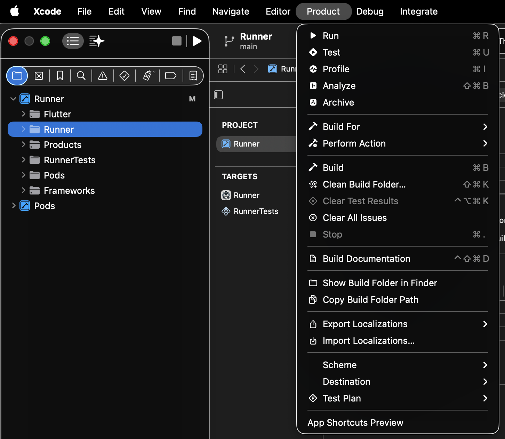
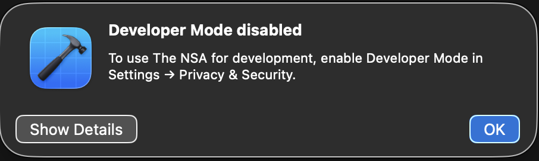

# iOS Mobile Dev Setup

Total nightmare.

## Setup

Install XCode, including the iOS dev kit.

## Opening Autobutler

Open the [Runner XCode project](../ios/Runner.xcodeproj/)

## Setting up Development Profile

Once project is open, go to the Runner project's "Signing and Capabilities" menu by Clicking on the top-level Runner item
in the file tree thing.



Login with an account tied to Autobutler LLC, then you should get that as an option in the "Team" dropdown on the side.

## Signing Certificate

Under "Signing Certificate", you should have some big warning message. Just go to the link there and follow the instructions
to add your iOS device to your developer account as a trusted device.

### Offline

When it asks you, say "Yes" to having offline support. This lets you use the dev install of the app for 7 days at a time
with no internet connection to refresh it.

### UDID

At some point, the website will ask you for your phone's UDID, which you can find by plugging in your phone via USB, trusting
the device, then going to it in Finder.


Where it shows the kind of iPhone and storage under the phone name in this menu, just click that text and it will change
to a serial and other numbers. Click it until the UDID shows up.

You CANNOT copy and paste this value. You must type it out by hand elsewhere, and then put it in the web site. `¯\_(ツ)_/¯`

After copying that in and clicking register a few times, you will get a registration complete page.


## Ready to Dev

Go back to XCode now, change tabs back and forth and now the page should look like so.



## Running On the Device

My phone is called "The NSA", so at the top of XCode make sure your phone is now selected like mine is, as that makes it
the "Run Target" for the app.


Then click "Product -> Run" to compile and hand off to device.



## Troubleshooting

### "The sandbox is not in sync with the Podfile.lock"

If the build fails with an error like:

> The sandbox is not in sync with the Podfile.lock. Run 'pod install' or update your CocoaPods installation.

the installed CocoaPods are out of sync with `Podfile.lock` (this happens after pulling
changes that touch Flutter dependencies). Fix it by re-syncing the pods from the repo root:

```sh
make tidy/flutter
```

On macOS this runs `flutter pub get` and then `pod install` in `ios/`. Once it finishes,
go back to XCode and run again.

### Developer Mode is Disabled

You may get a pop-up saying you do not have Developer Mode enabled on your iPhone. Follow it's instructions to enable.



### "Installation on this device is prohibited by ManagedConfiguration"

If the app compiles and gets all the way to installing, then fails with:

> Failed to install the app on the device. (com.apple.dt.CoreDeviceError, Code 3002)
> Installation on this device is prohibited by ManagedConfiguration (IXRemoteErrorDomain, Code 9)

your device is refusing the install because of a **ManagedConfiguration** restriction. This
is _not_ an Xcode signing/profile problem, for the build already succeeded. Two things can cause it:

1. **Screen Time app-install restriction (most common on a personal device).** iOS implements
   Screen Time's Content & Privacy Restrictions through the same ManagedConfiguration subsystem,
   so this fires even when there is **no** MDM profile installed.
2. **An MDM / device-management profile** (a work-managed device). Check
   **Settings -> General -> VPN & Device Management**. If a work profile is enforcing this, your
   MDM admin has to allow developer installs — you can't override it locally.

#### Enable installing apps

1. **Settings → Screen Time → Content & Privacy Restrictions**
2. **iTunes & App Store Purchases → Installing Apps** → set to **Allow**
3. Re-run from Xcode (**Product → Run**) — the install should now go through.
4. **When finished developing, set Installing Apps back to "Don't Allow."**

If the Screen Time toggle is locked or greyed out, Screen Time is managed by someone else
(Family Sharing organizer) or by an MDM profile, see cause #2 above.
