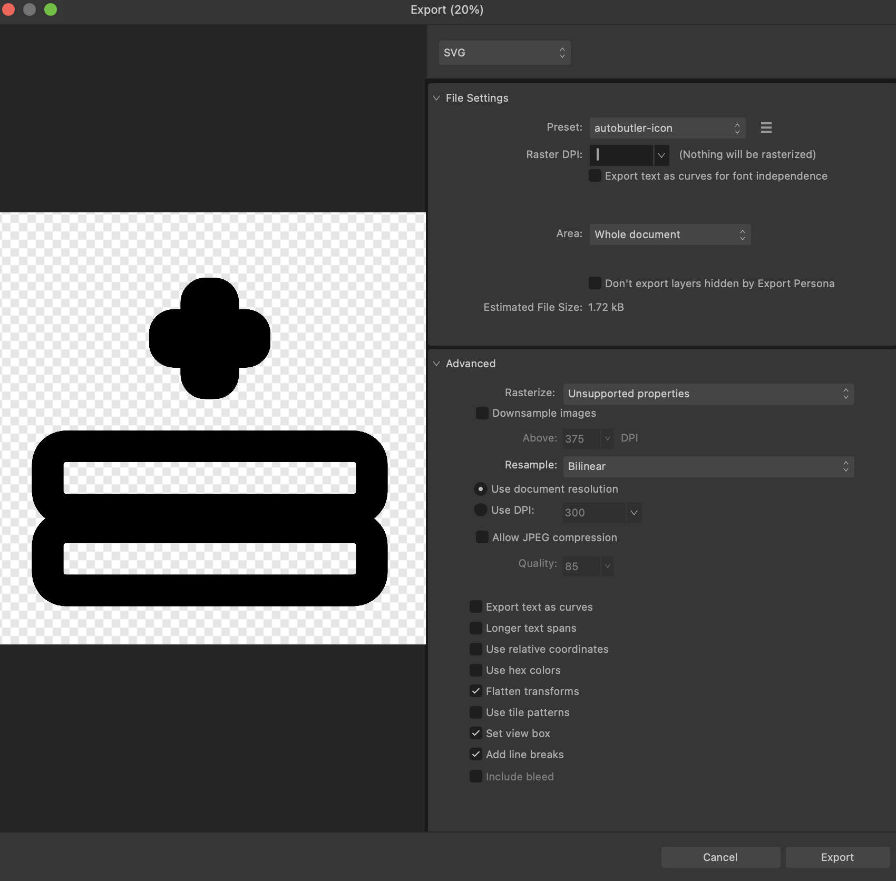

# autobutler_icons

Custom icon font for Autobutler — spreadsheet and app-specific icons not covered by Material Icons.

## Usage

```dart
import 'package:autobutler_icons/autobutler_icons.dart';

Icon(AutobutlerIcons.insert_row_above)
Icon(AutobutlerIcons.delete_column)
```

Works exactly like `Icons.*` from `package:flutter/material.dart`.

## Adding icons

1. Design the icon in Affinity Designer and save the source as an `.afdesign` file in `svgs/`
   (see [Exporting from Affinity Designer](#exporting-from-affinity-designer) below)
2. Export an svg into `svgs/` alongside it (stroke-based, `currentColor`)
3. Run `make generate/frontend/autobutler-icons` from the **repo root** (not this package)
4. The new icon name is the SVG filename (without `.svg`), snake_cased
5. Add a row for it to the [Icon set](#icon-set) table below

## Regenerating the font

Font generation is a repo-root operation — it's wired into the root `Makefile`, not this package's. From the repo root:

```bash
make generate/frontend/autobutler-icons
```

which runs:

```bash
npx fantasticon packages/autobutler_icons/svgs \
  --output packages/autobutler_icons/fonts \
  --font-types ttf \
  --name AutobutlerIcons \
  --config packages/autobutler_icons/.fantasticonrc.json \
  --normalize
```

Requires `fantasticon` (a root `package.json` dev dependency, run via `npx`). Codepoints for
existing icons are pinned in [`.fantasticonrc.json`](.fantasticonrc.json) so they stay stable
across regenerations; new icons are assigned the next free codepoint automatically.

## Exporting from Affinity Designer

In Affinity Designer, go to `File -> Export`, and export the document as an SVG with the following settings:



Feel free to create an `Export Preset` in Affinity, by clicking the hamburger menu near the top of the export menu.

## Icon set

| Constant              | Description                       |
| --------------------- | --------------------------------- |
| `insert_row_above`    | Insert row above selection        |
| `insert_row_below`    | Insert row below selection        |
| `delete_row`          | Delete selected row               |
| `duplicate_row`       | Duplicate selected row            |
| `clear_row`           | Clear contents of selected row    |
| `insert_column_left`  | Insert column left of selection   |
| `insert_column_right` | Insert column right of selection  |
| `delete_column`       | Delete selected column            |
| `duplicate_column`    | Duplicate selected column         |
| `clear_column`        | Clear contents of selected column |
